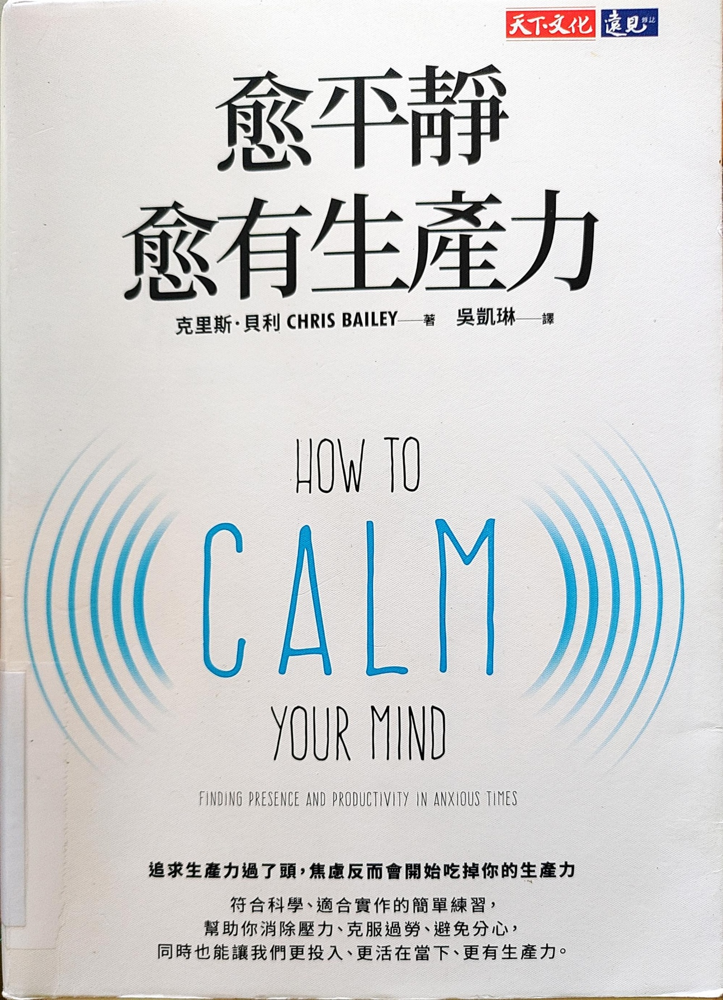

 

訂定生產力時間 （包含家事）和空閒時間
**專注在哪裡，成就在哪裡**
工作壓力來源

- 技術不清楚的部分

  - List all topics and study those one-by-one.

- 緊急項目，需要從會議或 teams 發覺

  - Use Pomodoro timer (50min focus + 5min short break + 50min focus +
    15min long break). Use break time to check emails and teams.

- 部門成員處裡及速度方法不如預期

  - Need to announce that (1) One ticket needs to be solved in one month
    normally. In case of critical or difficult one, need to have a
    closing path at least. (2) AE needs to act as a bridge to understand
    the customer\'s requirement and coordinate the internal resources
    accordingly. (3) Requesting other team\'s help needs to have a
    schedule. Or totally transfer this ticket to other team and the
    project leader(or PM) should be aware of this.

  - Need to ask the team member about the closing path, customer\'s
    status, other teams\' schedule, etc.

    - 貢獻度, 專業程度, 積極度(持續學習, 追蹤, 快速完成工作),
      協調溝通能力, 配合度

> 家庭壓力來源

- 苓苓花在社群媒體太多時間.

  - Need to let her know the body index.

    - Treat your body as a machine.

    - Plan ahead and spend your time/energy in the right place.

- 老婆花太多時間在網路和政治

  - What I am worried? Actually I just hate three things. (1) She does
    not listen to my opinions. (2) I hate that party and think anyone
    believe that is stupid. (3) I hate CH dramas.

  - So it is nothing related to her, it is all about my ego and what I
    think.
    斯多葛哲學告訴我們能讓自己生氣的只有自己，只有你自己能夠傷害自己，唯一能完全控制的只有自己的態度和作為。

  - What I need to do is to ask her (1) don\'t play any politic things
    when I am there. (2) don't talk to me about this party. (3) leave a
    message that I don\'t like the thing she spent so much time there.

- 家裏太亂

  - Do those things on my own.

> 自我壓力

- 穩定被動收入來源建立 -\> 須建立財務系統

- 理想退休生活模式建立 -\> 建立運動系統、藝文旅遊系統、不同朋友圈
  (登山朋友、跑步朋友、etc)

- 自我實現 -\> 建立學習系統。

- 台灣安全穩定和發展 -\> 固定時間看新聞，少看 FB
  偏激言論，做好應對措施。

>  
>
> 過勞三大特徵

- 筋疲力竭

- 憤世忌俗

- 缺乏生產力

> 過勞六個面向

- 工作量

- 失去控制

- 報籌 (錢或成就感）讚美不夠 -\> 每星期找出可以讚美的人

- 社群連結

- 公平

- 價值觀

> 防止過勞

- 有目標的行動，全心投入

- 好好品味生活

  - 那些時候讓你回味無窮？

    - 和法國人聊天，覺得自己可以和陌生外國人聊的好，很高興

    - 幫 team 成員解決問題，為自己的能力和幫忙高興

    - 騎自行車去計畫中的地方，對自己的安排和執行力高興，並且有時看到意料之外的美景

    - 在杉林溪看到大瀑布，還有漂亮的河邊

  - 三個體驗

    - 盡情享受

    - 讚歎

    - 感激

> 平靜

- 咖啡因，少喝咖啡，平常用綠茶取代

- 冥想

- 運動

- 朋友

- 飲食 -\> 16/8 的實踐。

- 時間的運用需要有目的性

>  
>
>  
